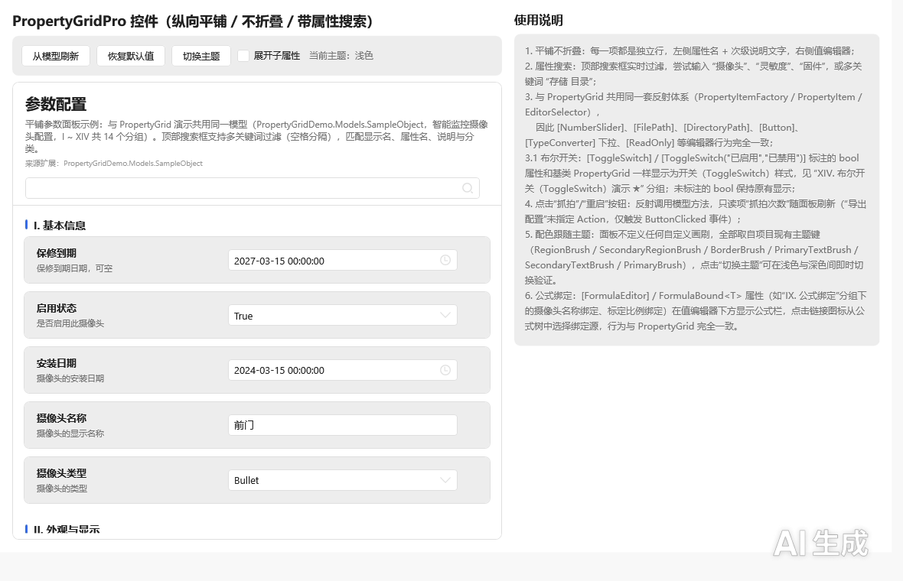
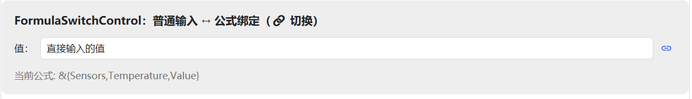
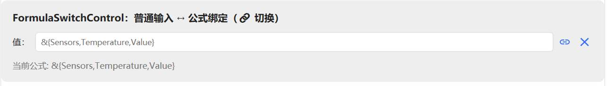
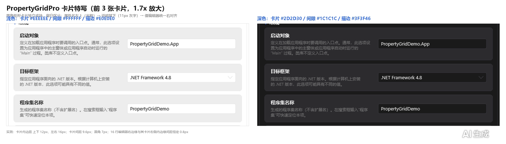
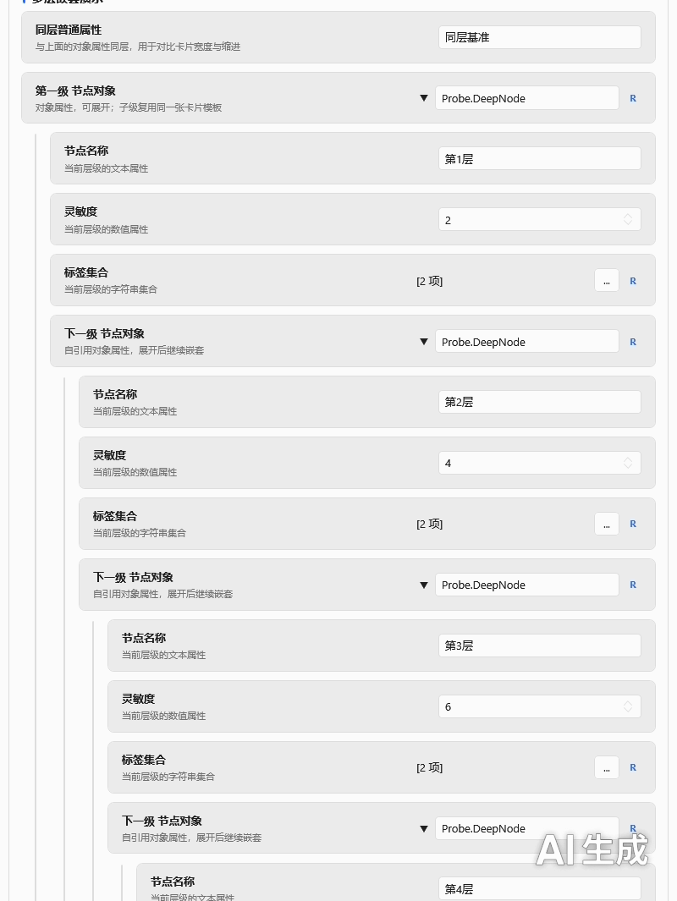
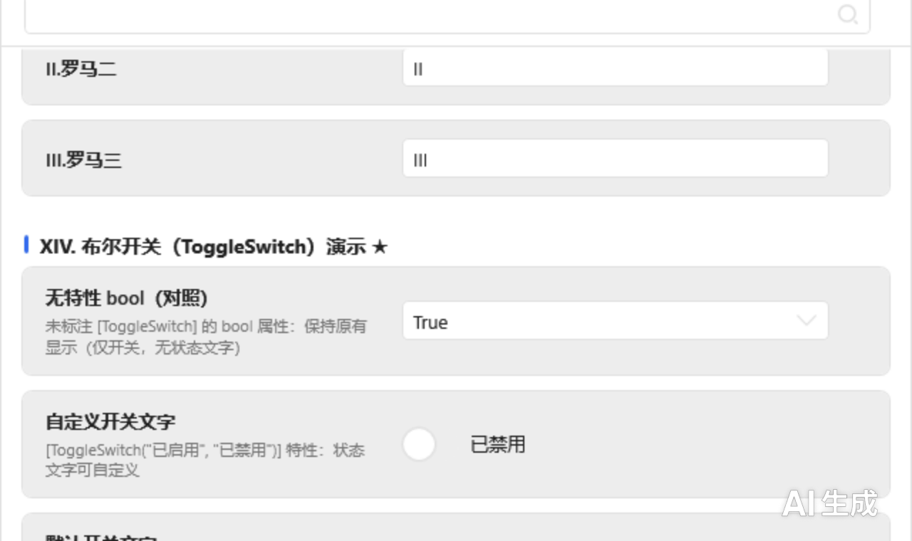
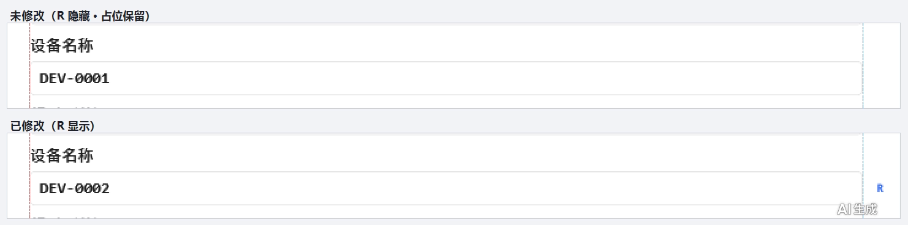

# PropertyGridDemo

[PropertyGridLib](https://www.nuget.org/packages/PropertyGridLib) 的官方演示项目 — WPF PropertyGrid 控件库，仿 WinForms PropertyGrid，基于 HandyControl UI 库。

> **作者：WangShuo** | 目标框架：.NET Framework 4.8

## 项目介绍

本 Demo 以「智能监控摄像头配置」为场景，完整演示 PropertyGridLib 的全部编辑器类型与扩展机制：

| 演示分类 | 内容 |
|---------|------|
| I. 基本信息 | string / bool / enum / DateTime / 可空类型 |
| II. 外观与显示 | 颜色编辑器（`Color` / `Color?` / `SolidColorBrush`）、数值滑块 `[NumberSlider]` |
| III. 网络配置 | 常规类型编辑 |
| IV. 存储路径 | 文件选择 `[FilePath]`、文件夹选择 `[DirectoryPath]` |
| V. 高级配置 | TypeConverter 下拉列表、多选列表 `[MultiSelect]` |
| VI. 检测区域 | 复杂对象展开编辑（内嵌 PropertyGrid） |
| VII. 集合编辑器 | 简单类型集合、复杂对象集合 `[CollectionEditor]` |
| VIII. 字典编辑器 | 简单键值、复杂对象值、嵌套字典自动弹窗 |
| IX. 公式绑定 | `FormulaBound<T>` + `[FormulaEditor]`，树形绑定源选择 |
| X. 操作按钮 | `[Button]` 命令按钮 + 反射调用 + 全局点击事件 |
| XI. 宿主扩展编辑器 | `RegisterEditor<TAttr>` 自定义「数值 + 单位下拉」编辑器 |
| XII. 只读与隐藏 | `[ReadOnly]` / `[Browsable(false)]` |
| XIII. 自然排序 | 属性排序演示 |
| XIV. 布尔开关 | `[ToggleSwitch]` 布尔开关（默认文字 / 自定义文字 / 仅开关不显示文字） |
| XV. 多行文本与类型 | `[MultilineText]` 多行富文本编辑、`Type` 类型属性（只读展示 / 类型选择） |

演示程序提供两个窗口，绑定同一个示例模型 `SampleObject`，便于对比：

| 窗口 | 说明 |
|------|------|
| `MainWindow` | `PropertyGrid` 基础控件：分类树 + 搜索 + 描述栏 + 主题 / 语言 / 字号切换 |
| `PropertyGridProDemoWindow` | `PropertyGridPro` 平铺参数面板：卡片式属性行、头部信息区、统一编辑器宽度 |

另有 `CollectionEditorDemoWindow`（标题「控件独立使用演示」），演示集合编辑器、字典编辑器与公式绑定控件**脱离 `PropertyGrid` 单独嵌入窗口**的用法。




此外还演示了：

- **深色 / 浅色主题切换**（HandyControl `Theme.Skin`，面板配色与控件硬编码色一并跟随主题）
- **中英文双语切换**（`IPropertyLocalization` + `LocalizationManager`）
- **全局字体 / 字号设置**（PropertyGrid 内所有弹窗编辑器同步跟随）
- **控件独立使用**：集合编辑器、字典编辑器、公式绑定控件脱离 PropertyGrid 单独嵌入窗口
- **无限嵌套子属性**（卡片式布局 + 层级引导线）
- **布尔开关特性** `[ToggleSwitch]`（滑块开关 + 可定制状态文字）

---

## v1.5.0 更新要点

| 变更 | 说明 |
|------|------|
| 修复 FormulaSwitchControl 重叠 | 「普通输入 ↔ 公式绑定」切换控件在公式模式下双输入框叠在一起，现改为随 `IsFormulaMode` 互斥显隐 |
| 新增 EventPicker 独立事件编辑器演示 | `EventPickerDemoWindow`：脱离 `PropertyGrid` 单独嵌入的事件选择控件 |
| XV. 多行文本与类型分组 | `[MultilineText]` 多行富文本编辑、`Type` 类型属性只读展示 |

FormulaSwitchControl 两种状态（修复后无重叠）：

| 普通输入模式 | 公式绑定模式 |
|---|---|
|  |  |

## v1.3.0 更新要点

| 变更 | 说明 |
|------|------|
| 新增 `PropertyGridPro` 演示窗口 | 平铺参数面板、卡片式行布局、头部信息区、统一编辑器宽度 |
| 新增 XIV. 布尔开关分组 | `[ToggleSwitch]` 特性三种用法（默认文字 / 自定义文字 / 仅开关） |
| 卡片式布局与主题色跟随 | 面板内硬编码深色改为主题资源键，浅色 / 深色双向切换正常 |
| 无限嵌套样式统一 | 子属性按层级缩进 + 引导线，各层级间距与圆角统一 |
| 公式绑定接入 Pro 面板 | `[FormulaEditor]` 属性在 Pro 面板同样显示公式绑定区 |
| 复位按钮常驻占位 | 未悬停时保留占位，同行编辑器不再左右跳动 |
| 清理旧模型 | 移除旧演示模型与右侧「实时值」区块，Pro 窗口改用共用的 `SampleObject` |

效果截图：

| 卡片式行布局 | 多级嵌套（浅色） | 布尔开关（浅色） | 复位按钮占位 |
|---|---|---|---|
|  |  |  |  |

> 完整使用文档见 [skill/SKILL.md](skill/SKILL.md)（快速开始 / 特性清单 / 编辑器类型 / 主题与多语言 / 公式绑定 / PropertyGridPro / 示例模型 / FAQ）。

## 运行

```bash
git clone https://github.com/1wangshuo/PropertyGridDemo.git
cd PropertyGridDemo
dotnet build PropertyGridDemo.csproj
```

用 Visual Studio 2022 打开 `PropertyGridDemo.csproj` 直接 F5 运行即可。

## 相关链接

| 资源 | 地址 |
|------|------|
| **控件库（NuGet）** | https://www.nuget.org/packages/PropertyGridLib |
| **使用文档（技能文档）** | [skill/SKILL.md](skill/SKILL.md) |
| **NuGet 包** | `Install-Package PropertyGridLib -Version 1.5.0` |

```xml
<PackageReference Include="PropertyGridLib" Version="1.5.0" />
```

## 许可证

MIT License
