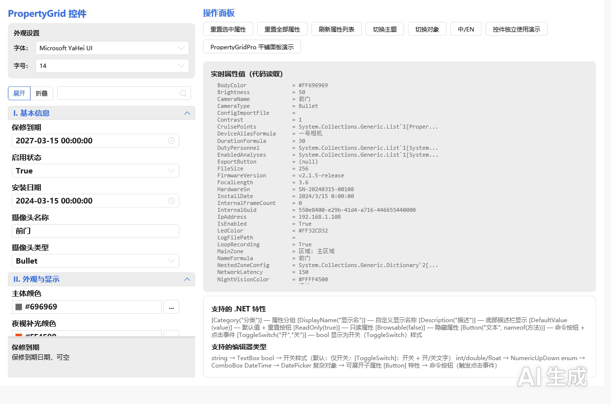

---
AIGC:
    Label: "1"
    ContentProducer: 001191440300708461136T1XGW3
    ProduceID: 09749610af649f3b41be24ad18fd73a1_fd688f6bb0e111f18039525400461939
    ReservedCode1: i4JLnMxq/rjXK/WmwHQSXzyD1B6Iqm/2iVEsG/BhbKT8vl7vIPNxoPi66Tj/0G2B8raZaLPCa4hPhddR/5Q4b1s+Y4fa8/YV/f/EUgXZuFQHJU20LnidfV6D6WpGgalPT5IdF8bo+JrnlWH9VKjIG5Pzwm2l6iMpynbOl4gQQQqXO7/bIhl6K3OtppE=
    ContentPropagator: 001191440300708461136T1XGW3
    PropagateID: 09749610af649f3b41be24ad18fd73a1_fd688f6bb0e111f18039525400461939
    ReservedCode2: i4JLnMxq/rjXK/WmwHQSXzyD1B6Iqm/2iVEsG/BhbKT8vl7vIPNxoPi66Tj/0G2B8raZaLPCa4hPhddR/5Q4b1s+Y4fa8/YV/f/EUgXZuFQHJU20LnidfV6D6WpGgalPT5IdF8bo+JrnlWH9VKjIG5Pzwm2l6iMpynbOl4gQQQqXO7/bIhl6K3OtppE=
---

# 01 快速开始与基础用法

> 目标：读完后你能在自己的 WPF 工程里放出一个可用的 PropertyGrid，知道绑定、刷新、重置、搜索、内联集合编辑分别怎么做。



---

## 一、引用与命名空间

```xml
xmlns:pg="clr-namespace:PropertyGridLib;assembly=PropertyGridLib"
```

程序集内的命名空间分工如下（写代码时按需 `using`）：

| 命名空间 | 内容 |
|---------|------|
| `PropertyGridLib` | **PropertyGrid**、**PropertyGridPro** 控件、`IPropertyLocalization` 接口 |
| `PropertyGridLib.Controls` | `PropertyItem`、`IPropertyItem`、`PropertyCategory`、`EditorTemplateSelector`、`FormulaBound<T>`、`FormulaTreeNode`、`IFormulaTreeProvider`、`IMultiSelectProvider`、`MultiSelectControl`、`FormulaBindingControl`、`CollectionEditorControl`、`DictionaryEditorControl`、`ColorEditControl`、`PropertyButtonClickEventArgs`、`CustomEditorType` 枚举 |
| `PropertyGridLib.Attributes` | `FilePathAttribute`、`DirectoryPathAttribute`、`CollectionEditorAttribute`、`NumberSliderAttribute`、`FormulaEditorAttribute`、`MultiSelectAttribute`、`ButtonAttribute`、`ToggleSwitchAttribute` |
| `PropertyGridLib.Dialogs` | `FolderBrowserDialog`、`CollectionEditorDialog`、`SimpleCollectionEditorDialog`、`DictionaryEditorDialog` |
| `PropertyGridLib.Localization` | `LocalizationManager`、`LocalizationProxy`、`LocalizedExtension`、`Language` 枚举 |
| `PropertyGridLib.Converters` | `BoolToVisibilityConverter`、`BoolToHiddenVisibilityConverter`、`InverseBoolConverter`、`ObjectToTypeConverter`、`ColorToBrushConverter` 等 |

---

## 二、最小可用示例

**XAML**

```xml
<Window x:Class="MyApp.MainWindow"
        xmlns="http://schemas.microsoft.com/winfx/2006/xaml/presentation"
        xmlns:x="http://schemas.microsoft.com/winfx/2006/xaml"
        xmlns:pg="clr-namespace:PropertyGridLib;assembly=PropertyGridLib"
        Title="配置" Width="720" Height="620">
    <Grid>
        <pg:PropertyGrid x:Name="PropertyGrid1"
                         ShowSearchBar="True"
                         ShowDescription="True"/>
    </Grid>
</Window>
```

**绑定对象（代码）**

```csharp
using System;
using System.ComponentModel;
using PropertyGridLib;

public class CameraConfig
{
    [Category("I. 基本信息")]
    [DisplayName("设备名称")]
    [Description("摄像头的显示名称，将出现在监控列表中")]
    [DefaultValue("Camera-01")]
    public string DeviceName { get; set; } = "Camera-01";

    [Category("I. 基本信息")]
    [DisplayName("启用录制")]
    public bool EnableRecording { get; set; } = true;

    [Category("I. 基本信息")]
    [DisplayName("分辨率")]
    public Resolution Resolution { get; set; } = Resolution.P1080;
}

public enum Resolution { P720, P1080, P4K }

// 绑定
PropertyGrid1.SelectedObject = new CameraConfig();
```

对象一旦绑定，控件会用反射枚举**公开、可读写、未标记 `[Browsable(false)]`** 的属性，并按「特性 → 属性类型 → 回退」的顺序选择编辑器（详见 [03 编辑器类型总览](03-编辑器类型总览.md)）。

---

## 三、常用依赖属性

| 属性 | 类型 | 默认值 | 说明 |
|------|------|--------|------|
| `SelectedObject` | `object` | `null` | 要编辑的目标对象 |
| `SearchText` | `string` | `""` | 搜索文本（自动过滤属性） |
| `ShowSearchBar` | `bool` | `true` | 是否显示搜索栏 |
| `ShowDescription` | `bool` | `true` | 是否显示底部描述栏 |
| `ShowTypeHint` | `bool` | `true` | 是否显示公式树与公式绑定区的类型提示 |
| `SelectedPropertyItem` | `IPropertyItem` | `null` | 当前选中的属性项 |
| `GroupedCategories` | `IEnumerable` | `null` | 分组后的分类列表（供绑定） |
| `IsLoading` | `bool` | `false` | 是否正在加载（切换对象时显示动画） |
| `FormulaTreeProvider` | `IFormulaTreeProvider` | `null` | 全局公式树提供者（可选，替代逐属性 `[FormulaEditor]`） |

---

## 四、静态成员与全局设置

| 成员 | 类型 | 说明 |
|------|------|------|
| `GlobalFontFamily` | `FontFamily` | 全局字体（默认 Consolas）；`PropertyGrid.FontFamily` 变化时自动同步 |
| `GlobalFontSize` | `double` | 全局字号（默认 12）；同上 |
| `CustomEditors` | `Dictionary<Type, DataTemplate>` | 宿主自定义编辑器注册表（AttributeType → DataTemplate） |
| `RegisterEditor<TAttribute>(template)` | `static void` | 泛型注册方法，一行注册宿主自定义编辑器 |
| `GlobalButtonClicked` | 静态事件 | 任意网格（含集合/字典内嵌网格、弹窗网格）中 `[Button]` 被点击时触发 |

```csharp
// 全局字号 + 自定义编辑器注册（App.xaml.cs 或窗口构造函数中执行一次即可）
PropertyGrid.GlobalFontSize = 13;
PropertyGrid.RegisterEditor<MyEditorAttribute>(myDataTemplate);
```

> `GlobalFontFamily` / `GlobalFontSize` 会同步到控件内所有弹窗编辑器，做到「一处设置、全局一致」。

---

## 五、公共方法与事件

| 方法 | 说明 |
|------|------|
| `RefreshProperties()` | 刷新属性列表（重新反射对象） |
| `ResetSelectedToDefault()` | 重置当前选中属性到初始值 |
| `ResetAllToDefault()` | 重置所有属性到初始值 |

| 事件 | 说明 |
|------|------|
| `ButtonClicked`（实例） | 本网格内 `[Button]` 属性被点击时触发，参数为 `PropertyButtonClickEventArgs`（含 `PropertyName` / `PropertyItem` / `Owner`） |
| `GlobalButtonClicked`（静态） | 所有 `PropertyGrid` 实例（含内嵌网格与弹窗网格）中的按钮点击；宿主订阅一次即可全局响应，**窗口关闭时记得取消订阅** |

```csharp
PropertyGrid.GlobalButtonClicked += OnAnyButtonClicked;
// ...
PropertyGrid.GlobalButtonClicked -= OnAnyButtonClicked;
```

> 重置按钮的出现条件是属性标注了 `[DefaultValue(...)]`（或可由 `IPropertyLocalization` 提供默认值）。默认值等于当前值时按钮自动隐藏，但仍保留占位，避免行内编辑器左右抖动。

---

## 六、集合与字典的内联显示

`SelectedObject` 直接传入集合或字典时，控件会自动切换为对应的内联编辑器模式，并隐藏常规属性列表：

| `SelectedObject` 类型 | 行为 |
|----------------------|------|
| `IList`（`string` 除外） | 内联显示集合编辑器（增删、复制、排序） |
| `IDictionary` | 内联显示字典编辑器（键/值均可为复杂对象并无限嵌套） |

```csharp
// 直接编辑一个字符串列表
PropertyGrid1.SelectedObject = new List<string> { "区域A", "区域B" };
```

而在复杂对象上，只要某属性是集合/字典类型或标注了 `[CollectionEditor]`，则该行显示「摘要文本 + 编辑按钮」，点击弹出对话框编辑。两种用法可同时存在。

---

## 七、与主题、多语言的衔接

- 主题：控件自身不合并主题资源，跟随宿主应用的 HandyControl 主题（`Theme.Skin`）。
- 多语言：实现 `IPropertyLocalization` 并提供翻译，配合 `LocalizationManager` 切换；语言变化时控件自动刷新全部属性的本地化文本。

具体做法与截图见 [04 主题与多语言](04-主题与多语言.md)。

---

## 八、下一步

- 想了解全部特性写法 → [02 特性清单](02-特性清单.md)
- 想知道某类型属性长什么样 → [03 编辑器类型总览](03-编辑器类型总览.md)
- 想要平铺式参数面板 → [06 PropertyGridPro 平铺参数面板](06-PropertyGridPro-平铺参数面板.md)
*（内容由AI生成，仅供参考）*
