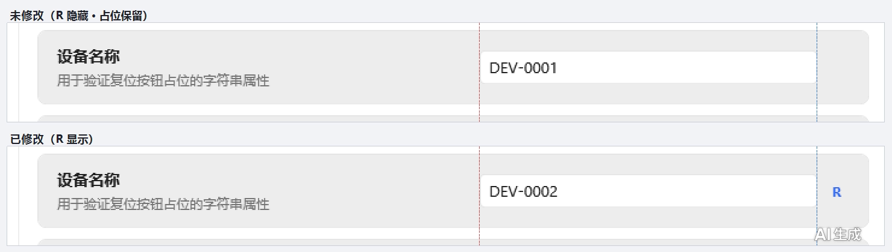
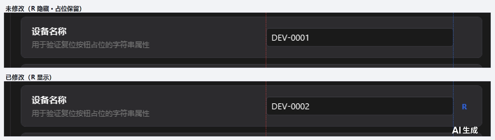

---
AIGC:
    Label: "1"
    ContentProducer: 001191440300708461136T1XGW3
    ProduceID: 09749610af649f3b41be24ad18fd73a1_ff3bf0c6b0e111f188ac525400dcc5b3
    ReservedCode1: aknuNuZ4Yv27wO2h97HZIZZKc7jpHX9KfciqYp7XrXc007GwcQt0TSBTt581A7hZM6lwnD8CYpR3CIR14kJ3Y2hfmaAQekD9ZJie9iGMVOAlQaFHCKxxP/nF1HNKGjzS7uIEABOOpMicBHidkqeiQoss1Hf5VmAz9lFWZRBMZOR1pKVxUWaTZjjtDP4=
    ContentPropagator: 001191440300708461136T1XGW3
    PropagateID: 09749610af649f3b41be24ad18fd73a1_ff3bf0c6b0e111f188ac525400dcc5b3
    ReservedCode2: aknuNuZ4Yv27wO2h97HZIZZKc7jpHX9KfciqYp7XrXc007GwcQt0TSBTt581A7hZM6lwnD8CYpR3CIR14kJ3Y2hfmaAQekD9ZJie9iGMVOAlQaFHCKxxP/nF1HNKGjzS7uIEABOOpMicBHidkqeiQoss1Hf5VmAz9lFWZRBMZOR1pKVxUWaTZjjtDP4=
---

# 03 编辑器类型总览

> 目标：对照属性类型 / 特性，查出它会渲染成什么编辑器；并知道如何注册自己的编辑器模板。

---

## 一、编辑器是怎么被选出来的

`PropertyGrid` 与 `PropertyGridPro` 共用同一个模板选择器 `EditorTemplateSelector`，选择顺序：

1. **宿主自定义编辑器**：`CustomEditors` 字典中命中该属性特性的 `DataTemplate`；
2. **特性驱动的内置编辑器**：`[FilePath]` / `[DirectoryPath]` / `[CollectionEditor]` / `[NumberSlider]` / `[FormulaEditor]` / `[MultiSelect]` / `[Button]` / `[ToggleSwitch]`；
3. **类型驱动的默认编辑器**：按属性类型（`string` / `bool` / 数值 / `enum` / `DateTime` / `Color` / 集合 / 字典 / 复杂对象 …）匹配；
4. **回退**：`TypeConverter` 提供标准值集合时显示下拉列表，否则按可展开的复杂对象处理。

---

## 二、编辑器总表

| 编辑器 | 触发条件 | 显示效果 |
|--------|---------|---------|
| TextBox | `string` 类型 | 文本输入框 |
| ToggleSwitch（默认 bool） | `bool` / `bool?` | 圆角滑块开关（无状态文字） |
| ToggleSwitch（带文字） | `[ToggleSwitch]` 特性（`bool`） | 滑块开关 + 开/关状态文字（文字可自定义或隐藏） |
| NumericUpDown | `int`、`double`、`float`、`decimal`、`long`、`short`、`byte` | 数字输入框（带增减按钮） |
| ComboBox | `enum` | 枚举下拉选择 |
| DateTimePicker | `DateTime` / `DateTime?` | 日期时间选择器 |
| Slider | `[NumberSlider]` 特性 | 滑块 + 数值标签（可切换为可编辑数字框） |
| Color | `Color` / `Color?` / `SolidColorBrush` | 颜色预览块 + `...` 按钮（弹出 HandyControl ColorPicker） |
| FilePath | `[FilePath]` 特性 | 文本框 + 浏览按钮 |
| DirectoryPath | `[DirectoryPath]` 特性 | 文本框 + 浏览按钮 |
| Collection | `[CollectionEditor]` 特性或 `IList` 类型 | 文本框 + 编辑按钮（弹出对话框） |
| Dictionary | `IDictionary` 类型（自动识别） | `N 项` + 编辑按钮；值为集合时显示 `N 项 ...` 并可弹窗深入 |
| DropDown | `TypeConverter` 提供标准值 | 下拉列表（支持排他 / 可编辑模式） |
| MultiSelect | `[MultiSelect]` 特性 | 摘要文本 + 弹出 CheckBox 列表 |
| Button | `[Button]` 特性 | 命令按钮（触发宿主方法 / 事件） |
| Expandable | 复杂对象（非简单类型、非集合） | 可展开子属性 |
| Formula | `[FormulaEditor]` 特性或 `FormulaBound<T>` | 值编辑器 + 公式绑定区 |
| 宿主自定义 | `PropertyGrid.CustomEditors` 注册的特性 | 宿主提供的 `DataTemplate` |

> 同一类型的属性在不同主题下外观不同，但触发条件与行为一致；主题相关见 [04 主题与多语言](04-主题与多语言.md)。

---

## 三、属性行上的交互元素

| 元素 | 出现条件 | 说明 |
|------|---------|------|
| 分类头 | 属性存在 `[Category]` | 分组标题，可折叠子属性 |
| 展开箭头 | 属性值为可展开的复杂对象 | 展开后以嵌套方式显示子属性（层级不限） |
| 复位按钮（R） | 属性标注了 `[DefaultValue]` 且当前值不等于默认值 | 点击恢复默认值；**未悬停时隐藏但保留占位**，不挤动同行编辑器 |
| 描述栏 | `ShowDescription="True"` | 显示当前选中属性的 `[Description]` 文本 |
| 搜索栏 | `ShowSearchBar="True"` | 实时过滤属性行 |

复位按钮的「常驻占位」是 1.3.0 的重点修复：此前隐藏按钮使用 `Collapsed`，鼠标移入/移出会导致同行的值编辑器左右跳动；现在改为 `Hidden`（由 `BoolToHiddenVisibilityConverter` 转换），编辑器位置实测位移 **0px**。

| 修复前（上）/ 修复后（下）· 基础控件浅色 | 基础控件深色 | Pro 面板浅色 | Pro 面板深色 |
|---|---|---|---|
|  |  |  |  |

---

## 四、集合 / 字典 / 对话框编辑器

| 编辑器 | 宿主 | 适用 |
|--------|------|------|
| `CollectionEditorControl` / `SimpleCollectionEditorControl` | `CollectionEditorDialog` / `SimpleCollectionEditorDialog` | 复杂对象集合 / 简单类型集合 |
| `DictionaryEditorControl` | `DictionaryEditorDialog` | 字典（键值均可为复杂对象，支持嵌套字典继续弹窗） |
| `ColorEditControl` | HandyControl `ColorPicker` | 颜色选择 |
| `MultiSelectControl` | 内联弹出 | 多选列表 |
| `FormulaBindingControl` | 内联 / 独立嵌入 | 公式绑定 |

对话框自身跟随应用主题与多语言，无需额外配置。

---

## 五、注册宿主自定义编辑器

三种途径（推荐第 1 种）：

```csharp
// 1. 泛型注册（一行）
PropertyGrid.RegisterEditor<MyEditorAttribute>(dataTemplate);

// 2. 直接写入字典（静态成员）
PropertyGrid.CustomEditors[typeof(MyEditorAttribute)] = dataTemplate;

// 3. 派生控件覆盖模板选择器属性（如 ToggleSwitchTemplate 等）
```

`PropertyGridLib.Controls.CustomEditorType` 枚举用于描述自定义编辑器的类型归属，便于宿主按需组织模板。

> 注册后，凡是标注了 `MyEditorAttribute` 的属性行都会使用你的 `DataTemplate` 渲染；未注册时自动回退到内置编辑器，不会出现空白行。
*（内容由AI生成，仅供参考）*
