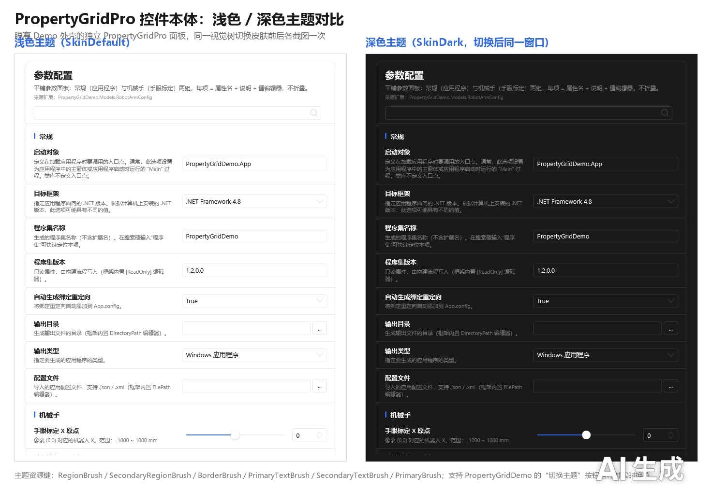

---
AIGC:
    Label: "1"
    ContentProducer: 001191440300708461136T1XGW3
    ProduceID: 09749610af649f3b41be24ad18fd73a1_0025fe46b0e211f18039525400461939
    ReservedCode1: L+2Z+IxNBlsapRKL34os9q06alFZ1IZq1UDA23IUDrlnMu9iwJ9DXZk5Ex5eeSwEfysmClGv6/uftd0EqYEhoicIIIcVFsWADYnv74XNblfKW/jm21r0uXW5fIufC4nP6bP2bKnTGsmetZWJsvmlGamT9bc/glmvnzulRu58wvqRq5njPx5lZ61LZw0=
    ContentPropagator: 001191440300708461136T1XGW3
    PropagateID: 09749610af649f3b41be24ad18fd73a1_0025fe46b0e211f18039525400461939
    ReservedCode2: L+2Z+IxNBlsapRKL34os9q06alFZ1IZq1UDA23IUDrlnMu9iwJ9DXZk5Ex5eeSwEfysmClGv6/uftd0EqYEhoicIIIcVFsWADYnv74XNblfKW/jm21r0uXW5fIufC4nP6bP2bKnTGsmetZWJsvmlGamT9bc/glmvnzulRu58wvqRq5njPx5lZ61LZw0=
---

# 04 主题与多语言

> 目标：让你的配置面板跟随应用的浅色 / 深色主题，并支持中英文（或自定义语言）切换。

---

## 一、主题机制

`PropertyGridLib` **不自行合并主题资源**：控件本体与它弹出的所有对话框都继承应用级资源字典，主题切换由宿主统一驱动（基于 HandyControl 的主题机制，Demo 中由 `ThemeHelper` 封装为一行切换）。

```xml
<!-- App.xaml：合并 HandyControl 主题资源（宿主负责，库内不再重复合并） -->
<ResourceDictionary Source="pack://application:,,,/HandyControl;component/Themes/SkinDefault.xaml"/>
<ResourceDictionary Source="pack://application:,,,/HandyControl;component/Themes/Theme.xaml"/>
```

```csharp
// 切换主题（Demo 的封装：ThemeHelper.Toggle()）
ThemeHelper.Toggle();
```

### 1.3.0：主题色跟随（去掉硬编码）

1.3.0 之前，`PropertyGridPro` 面板模板中存在硬编码的深色值，切换浅色主题后卡片/文字仍偏暗。本次已把全部硬编码替换为 `SkinDark`、`ThemeHelper` 等主题资源键，实现：

- 卡片背景、边框、圆角描边跟随主题；
- 标题 / 描述 / 来源文字与分类头颜色跟随主题；
- 嵌套子属性的缩进**引导线**颜色跟随主题；
- 布尔开关的轨道（开态蓝色 / 关态灰色）与滑块保持在各主题下的对比度。

| PropertyGrid 浅色 | PropertyGrid 深色 |
|---|---|
|  |  |

| Pro 面板同屏对比（左深右浅） | Pro 面板主题跟随细节 |
|---|---|
|  |  |

| 开关区域浅色 | 开关区域深色 |
|---|---|
|  |  |

> 若宿主未提供上述资源键，控件会自动回退到 HandyControl 的默认画刷，不会出现透明或不可读的元素。

---

## 二、全局字体与字号

```csharp
PropertyGrid.GlobalFontFamily = new FontFamily("Microsoft YaHei");
PropertyGrid.GlobalFontSize = 13;
```

| 静态成员 | 默认值 | 说明 |
|---------|--------|------|
| `GlobalFontFamily` | Consolas | 全局字体；实例属性 `FontFamily` 变化时自动同步 |
| `GlobalFontSize` | 12 | 全局字号；实例属性 `FontSize` 变化时自动同步 |

全局设置会同步应用到控件内的**所有弹窗编辑器**（集合、字典、颜色、文件夹浏览等），做到一处设置、全局一致。

---

## 三、多语言

### 实现你的本地化

```csharp
using PropertyGridLib;

public class MyLocalization : IPropertyLocalization
{
    // 按当前语言返回属性显示名 / 描述 / 枚举文本等
}
```

配合 `LocalizationManager` 注册与切换语言；控件内部监听 `LocalizationManager.LanguageChanged` 事件，**语言切换后自动刷新所有属性的本地化文本**，无需重建控件或重新绑定对象。

| 成员 | 说明 |
|------|------|
| `LocalizationManager` | 语言注册与切换入口 |
| `IPropertyLocalization` | 宿主实现的本地化接口（属性显示名、描述、分类名、枚举项等） |
| `LocalizationProxy` | 代理对象，用于把本地化结果暴露给 XAML 绑定 |
| `LocalizedExtension` | XAML 标记扩展，用于给界面元素提供本地化文本 |
| `Language` 枚举 | 内置语言枚举（兼容保留） |

> 1.3.0 起推荐使用 **`LocalizationManager.CurrentCulture`**（`culture` 字符串开集，如 `"zh-CN"`、`"en-US"`）；旧的 `CurrentLanguage`（`Language` 枚举）标记为过时，仅为兼容保留。

### Demo 中的效果

演示程序主窗口提供「中文 / English」切换按钮，切换后：属性显示名、描述、分类标题、枚举文本、对话框按钮与标题全部跟随；同时可切换浅色 / 深色主题、调整全局字号验证一致性。

---

## 四、常见问题

| 现象 | 原因与处理 |
|------|-----------|
| 控件整体仍是浅色 / 深色不生效 | 宿主未合并 HandyControl 主题资源，或切换时未作用于应用级资源字典 |
| 弹窗（集合 / 字典 / 颜色）不跟随主题 | 弹窗继承应用级资源，检查是否在弹窗创建前完成了主题切换 |
| 切换语言后部分文本未刷新 | 对应属性/分类名未在 `IPropertyLocalization` 中提供翻译，回退为 `[DisplayName]` / 属性名 |
| 字体设置只对新行生效 | 使用静态 `GlobalFontFamily` / `GlobalFontSize`（会在全局同步），而非仅设置单个实例 |
*（内容由AI生成，仅供参考）*
