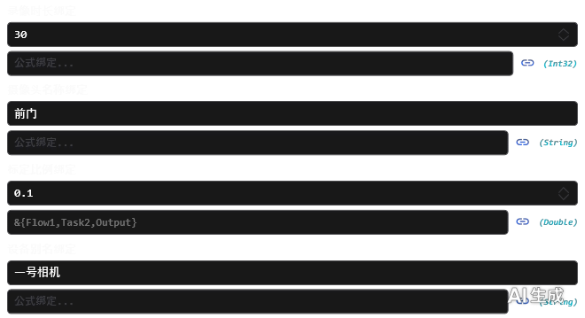

---
AIGC:
    Label: "1"
    ContentProducer: 001191440300708461136T1XGW3
    ProduceID: 09749610af649f3b41be24ad18fd73a1_0101d995b0e211f1af37525400826444
    ReservedCode1: smyD4MEHm4m1T52AQmWk47g4WmWG3EOq3Ei15THYMFe1MRRPQTqfcinuZKzDwpdNf0kFWInS17D/PS45XOje+4LEBcYR8iE/IGnAbN95nXNljMhGn8Gu/6eK8wYkMuC1sq1EeCXy56k37ybxIuu0SNR+1U+9CnNBWU4O5AbRYVVmKIHFkaWpfcZJMy0=
    ContentPropagator: 001191440300708461136T1XGW3
    PropagateID: 09749610af649f3b41be24ad18fd73a1_0101d995b0e211f1af37525400826444
    ReservedCode2: smyD4MEHm4m1T52AQmWk47g4WmWG3EOq3Ei15THYMFe1MRRPQTqfcinuZKzDwpdNf0kFWInS17D/PS45XOje+4LEBcYR8iE/IGnAbN95nXNljMhGn8Gu/6eK8wYkMuC1sq1EeCXy56k37ybxIuu0SNR+1U+9CnNBWU4O5AbRYVVmKIHFkaWpfcZJMy0=
---

# 05 公式绑定

> 目标：让用户把某个属性「绑定到流程中的其它变量」，并支持树形选择、类型提示与手动输入公式。

---

## 一、它长什么样

标注 `[FormulaEditor]` 的属性行会在原有值编辑器**下方**增加一行公式绑定区：链接图标 + 公式文本框 + 下拉（Popup）树选择器。用户在树里点选节点即写入对应公式；也可以直接在文本框手输公式。

| 公式绑定行（浅色） | 公式绑定行（深色） |
|---|---|
|  |  |

| 公式树弹窗（深色） | 基础控件中的公式行（深色） |
|---|---|
|  |  |

---

## 二、最小用法

### 1. 模型侧：属性类型用 `FormulaBound<T>`

```csharp
using PropertyGridLib.Attributes;
using PropertyGridLib.Controls;

[Category("IX. 公式绑定")]
[DisplayName("摄像头名称绑定")]
[FormulaEditor(typeof(DemoFormulaTreeProvider))]     // 指定公式树提供者
public FormulaBound<string> NameFormula { get; set; } = new FormulaBound<string> { Value = "默认值" };
```

`FormulaBound<T>` 同时承载「静态值」与「绑定公式」两种状态：未绑定时使用 `Value`，绑定后由公式决定取值。

### 2. 提供方侧：实现 `IFormulaTreeProvider`

```csharp
using PropertyGridLib.Controls;

public class DemoFormulaTreeProvider : IFormulaTreeProvider
{
    public List<FormulaTreeNode> GetFormulaTree(PropertyItem propertyItem)
    {
        return new List<FormulaTreeNode>
        {
            new FormulaTreeNode
            {
                Header = "流程A",
                Children = new List<FormulaTreeNode>
                {
                    new FormulaTreeNode
                    {
                        Header = "任务1",
                        Children = new List<FormulaTreeNode>
                        {
                            new FormulaTreeNode
                            {
                                Header = "属性X",
                                Formula = "&{流程A.任务1.属性X}",
                                FormulaType = typeof(int)          // 供界面显示类型提示
                            }
                        }
                    }
                }
            }
        };
    }
}
```

`GetFormulaTree` 每次展开时按传入的 `PropertyItem` 动态生成树，因此可以**按属性类型过滤**候选变量（例如 `int` 属性只列出整数型变量）。

---

## 三、API 说明

### FormulaTreeNode

| 属性 | 类型 | 说明 |
|------|------|------|
| `Header` | `string` | 节点显示文本 |
| `Formula` | `string` | 选中后填入的公式字符串（仅叶子节点需要设置） |
| `Children` | `List<FormulaTreeNode>` | 子节点列表（支持任意层级） |
| `FormulaType` | `Type?` | 叶子节点的数值类型（如 `typeof(int)`），用于弹窗中显示类型提示 |
| `TypeHint` | `string` | 由 `FormulaType` 自动生成的提示文本（如 `(int)`、`(string)`） |

### 公式语法

```
&{流程A.任务1.属性X}
```

- 以 `&{` 开始、`}` 结束；
- 层级之间用 `.` 分隔，与树节点的 `Header` 名称一致；
- 多个变量可组合在同一个公式表达式中（由宿主在取值时解析）。

### 全局提供者与类型提示

| 成员 | 说明 |
|------|------|
| `PropertyGrid.FormulaTreeProvider` | 全局公式树提供者。整表共用一棵树时设置一次即可，无需逐属性标注 `[FormulaEditor]` |
| `PropertyGrid.ShowTypeHint` | 是否显示公式树弹窗与绑定区的类型提示（默认 `true`） |

```csharp
// 整表统一使用同一个公式树
PropertyGrid1.FormulaTreeProvider = new DemoFormulaTreeProvider();
PropertyGrid1.ShowTypeHint = true;
```

---

## 四、独立使用

`PropertyGridLib.Controls.FormulaBindingControl` 可以脱离 `PropertyGrid` 单独嵌入任意窗口（Demo 中即有独立演示），把公式树数据源直接提供给控件即可获得同样的「文本框 + 树选择器」体验，适合自定义布局的参数面板。

---

## 五、实践建议

| 建议 | 原因 |
|------|------|
| 给叶子节点设置 `FormulaType` | 让用户在选变量时看到 `(int)` / `(string)` 之类的类型提示，减少类型不匹配 |
| 在 `GetFormulaTree` 中按 `propertyItem` 过滤候选 | 避免把字符串变量绑给数值属性 |
| 频繁复用同一棵树时使用全局 `FormulaTreeProvider` | 少写一份 `[FormulaEditor]`，也便于统一维护 |
| 关闭 `ShowTypeHint` 可让界面更紧凑 | 面向非技术用户的参数面板可隐藏类型信息 |
*（内容由AI生成，仅供参考）*
