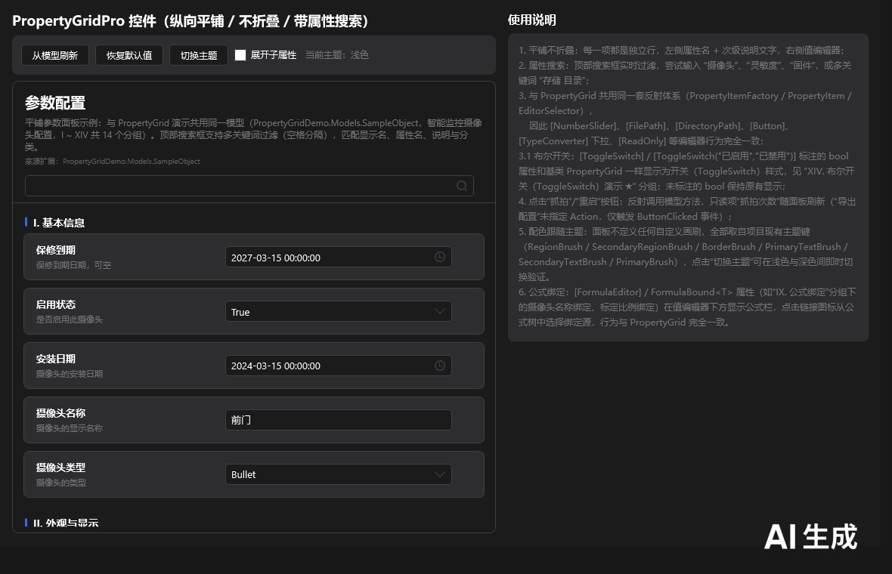
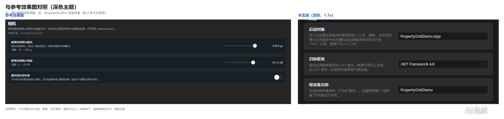
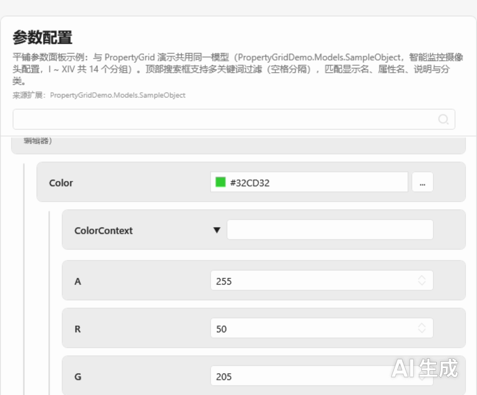
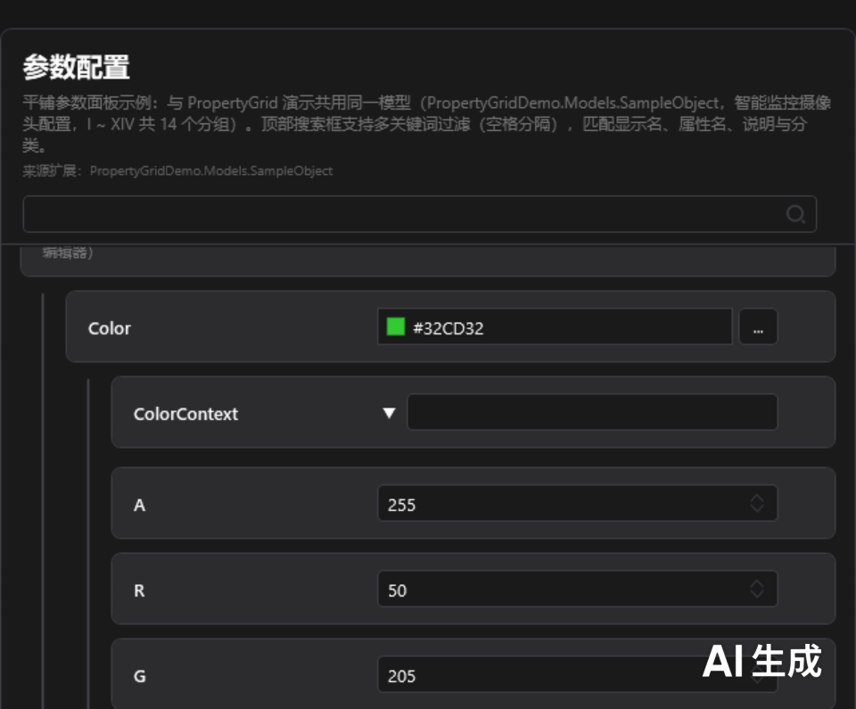
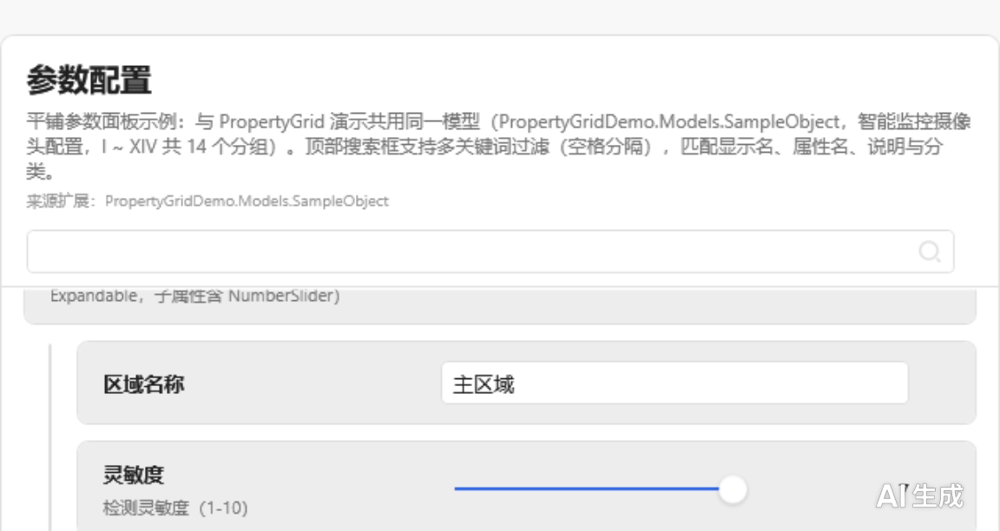
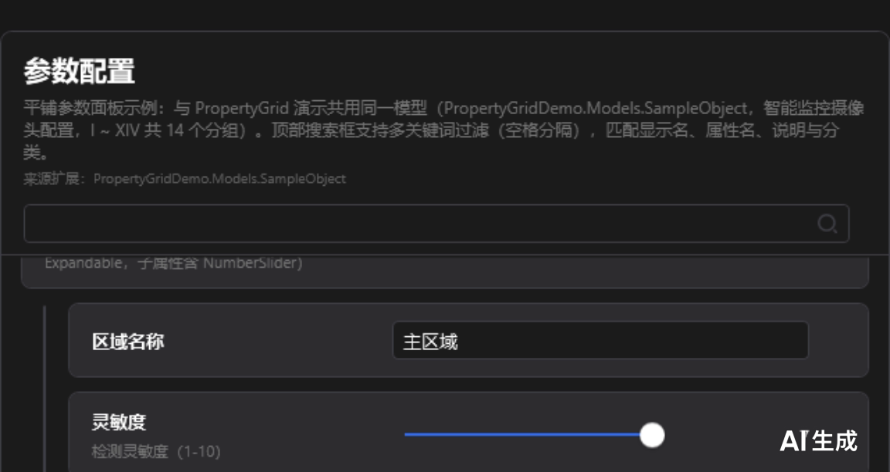

---
AIGC:
    Label: "1"
    ContentProducer: 001191440300708461136T1XGW3
    ProduceID: 09749610af649f3b41be24ad18fd73a1_01e9fa9eb0e211f1af37525400826444
    ReservedCode1: wcMOof0NSI21PwnqDJ6+GsAdjla0Ntkw2YzCv5SlN0tJsOUiW9tSFSThavYGncwW97saYDgpBNsa4RwB03o/WYdzRD9MHBStEUeoo3vekzsZ3eSP2YHwjMkboXcnTFup424qYrDbFI+oRcVzNB4WgiKbWGFAfMjq+UZ0iV0dbYFrsDyG6Z4+m5AEmHM=
    ContentPropagator: 001191440300708461136T1XGW3
    PropagateID: 09749610af649f3b41be24ad18fd73a1_01e9fa9eb0e211f1af37525400826444
    ReservedCode2: wcMOof0NSI21PwnqDJ6+GsAdjla0Ntkw2YzCv5SlN0tJsOUiW9tSFSThavYGncwW97saYDgpBNsa4RwB03o/WYdzRD9MHBStEUeoo3vekzsZ3eSP2YHwjMkboXcnTFup424qYrDbFI+oRcVzNB4WgiKbWGFAfMjq+UZ0iV0dbYFrsDyG6Z4+m5AEmHM=
---

# 06 PropertyGridPro 平铺参数面板

> 目标：用 `PropertyGridPro` 做出「参数面板」风格的界面：纵向平铺、卡片式属性行、带头部信息与属性搜索。1.3.0 新增控件。

---

## 一、效果

| PropertyGridPro（浅色） | PropertyGridPro（深色） |
|---|---|
|  |  |

与 `PropertyGrid` 相比，Pro 面板在不大改使用方式的前提下把「层级表格」换成了「平铺卡片」：

| 对比项 | `PropertyGrid` | `PropertyGridPro` |
|--------|----------------|-------------------|
| 整体布局 | 分类 + 可折叠树形层级 | 纵向平铺，属性与分组直接铺开，列表整体滚动 |
| 属性行 | 通栏式行 | 卡片式行（圆角、行间距、分类头卡片） |
| 头部区 | 无 | `Header` 标题 + `HeaderDescription` 描述 + `SourceText` 来源说明 |
| 属性搜索 | 有（过滤属性行） | 有（过滤 + 匹配计数 + 空结果提示） |
| 编辑器宽度 | 随行自适应 | `EditorWidth` 统一控制，行内编辑器对齐 |
| 行模板 | 内置 | `RowTemplate` 可替换，宿主可自定义整行外观 |

两者共用同一套特性、编辑器模板、本地化与主题资源，**模型代码无需任何改动即可在两者之间切换**。

---

## 二、最小用法

```xml
<Window xmlns:pg="clr-namespace:PropertyGridLib;assembly=PropertyGridLib">
    <pg:PropertyGridPro x:Name="PropertyGridPro1"
                        Header="参数配置"
                        HeaderDescription="修改后立即生效，带 * 的属性需要重启界面"
                        SourceText="PropertyGridDemo.Models.SampleObject"
                        ShowHeader="True"
                        ShowSearchBar="True"
                        ShowDescription="True"
                        EditorWidth="220"/>
</Window>
```

```csharp
PropertyGridPro1.SelectedObject = new SampleObject();
```

---

## 三、依赖属性

| 属性 | 类型 | 默认值 | 说明 |
|------|------|--------|------|
| `SelectedObject` | `object` | `null` | 要编辑的目标对象（与 `PropertyGrid` 一致） |
| `Header` | `string` | 空 | 面板标题 |
| `HeaderDescription` | `string` | 空 | 标题下的说明文字 |
| `SourceText` | `string` | 空 | 来源说明（如模型类型的完整名称） |
| `ShowHeader` | `bool` | `true` | 是否显示头部区 |
| `ShowSearchBar` | `bool` | `true` | 是否显示属性搜索栏 |
| `ShowDescription` | `bool` | `true` | 是否显示底部描述栏 |
| `EditorWidth` | `double` | 内置值 | 行内编辑器统一宽度 |
| `RowTemplate` | `DataTemplate` | 内置模板 | 整行卡片模板，可整体替换外观 |
| `SearchText` | `string` | `""` | 搜索关键字 |
| `SelectedPropertyItem` | `IPropertyItem` | `null` | 当前选中的属性项 |
| `GroupedCategories` | `IEnumerable` | `null` | 分组数据源（供绑定） |

---

## 四、公共方法

| 方法 | 说明 |
|------|------|
| `RefreshProperties()` | 刷新属性列表 |
| `ResetAllToDefault()` | 重置全部属性到默认值 |
| `ResetSelectedToDefault()` | 重置当前选中属性 |
| `SetSubPropertiesExpanded(bool expanded)` | 批量展开 / 折叠所有子属性（嵌套对象） |

---

## 五、属性搜索

搜索栏实时过滤属性；无匹配时给出明确提示，并显示匹配数量，便于确认是「真的没有该属性」还是「关键字写错了」。

| 搜索命中（浅色） | 搜索命中（深色） |
|---|---|
|  |  |

| 命中多条（浅色） | 命中多条（深色） |
|---|---|
|  |  |

| 无匹配结果（浅色） | 无匹配结果（深色） |
|---|---|
|  |  |

---

## 六、卡片式行布局

属性行使用卡片承载：圆角 7、行间距、分类头单独成卡片，卡片底色取主题的次级区域画刷（`SecondaryRegionBrush`），因此深浅主题下均保持层次分明。

| 卡片式行细节（浅色） | 卡片式行与参考样式对照 |
|---|---|
|  |  |

---

## 七、嵌套子属性

复杂对象的子属性同样以卡片铺开，并按层级增加缩进与**引导线**，层级不限；1.3.0 统一了各层级的间距、圆角与引导线样式，避免深层嵌套后视觉走形。

| 多级嵌套（浅色） | 多级嵌套（深色） | 多级嵌套长图（浅色） |
|---|---|---|
|  |  |  |

| 嵌套区域放大（浅色） | 嵌套区域放大（深色） |
|---|---|
|  |  |

---

## 八、与其它能力的组合

- **公式绑定**：标注 `[FormulaEditor]` 的属性在 Pro 面板中同样显示公式绑定行；也可用 `FormulaTreeProvider` 统一配置。
- **公式绑定行（Pro，深色）**：[](images/formula-binding-row-dark.png)
- **布尔开关**：`[ToggleSwitch]` 在 Pro 面板中的渲染与基础控件完全一致（同一编辑器模板）。
- **主题与语言**：跟随宿主主题与 `LocalizationManager`，切换后 Pro 面板整体重绘，见 [04 主题与多语言](04-主题与多语言.md)。
- **复位按钮**：仅在有 `[DefaultValue]` 且值被修改时出现，未悬停时保留占位，行内编辑器不位移。

---

## 九、选用建议

| 场景 | 建议 |
|------|------|
| 层级深、属性多、需要收纳 | `PropertyGrid`（可折叠分类 + 树形层级） |
| 参数面板 / 属性面板，强调一屏扫读 | `PropertyGridPro`（平铺 + 卡片） |
| 需要在两者之间切换 | 保持模型与特性不变，仅替换控件标签即可 |
*（内容由AI生成，仅供参考）*
