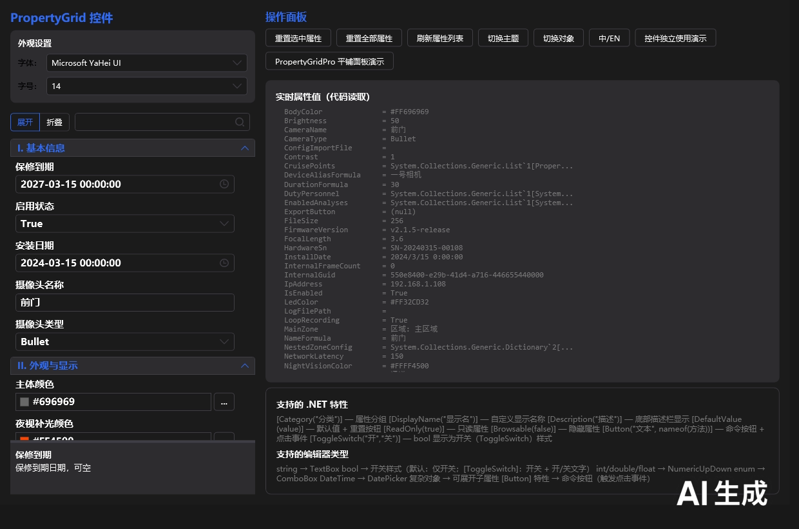
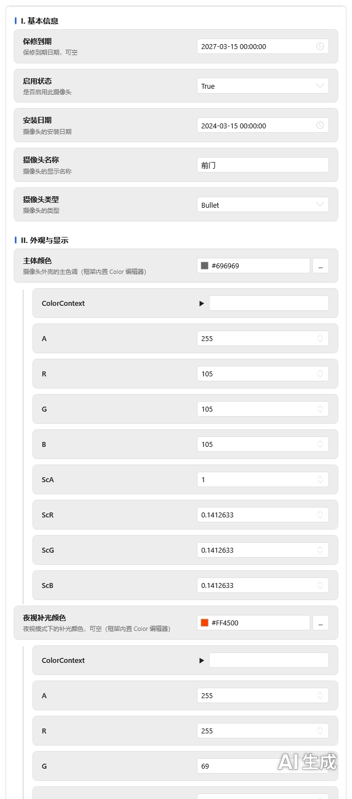
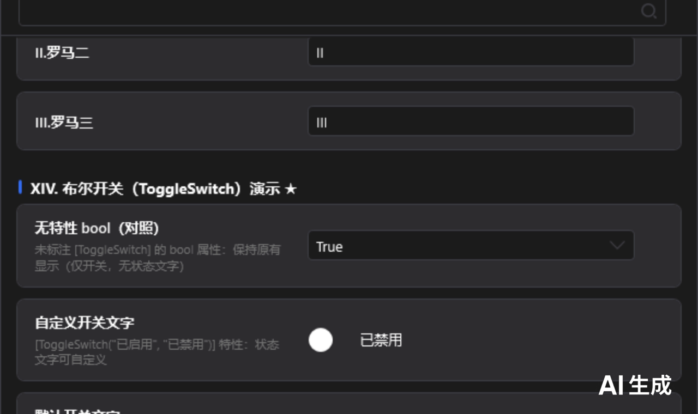
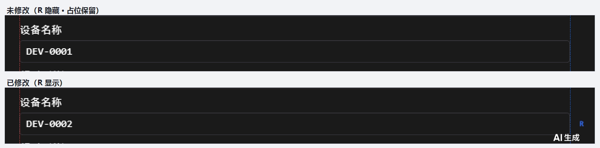

---
AIGC:
    Label: "1"
    ContentProducer: 001191440300708461136T1XGW3
    ProduceID: 09749610af649f3b41be24ad18fd73a1_02ee48f0b0e211f18f50525400aeaaa3
    ReservedCode1: mmqdq2uAnAMPmS4qz0HxtQEiRtytza37s85lwwimocB7NVtgALA97kJVw/6NrkqiV8Vc+HvFAr2armV1YgMVdF45YZbmKHoFbi/ontnwbiP0cb/IfQAfMuLXpahIXgokXl/rmNm8L6NnupSh8+yWnH35jGbvk5MgOblCP6gMvfIjmJFUfRZT+naydDM=
    ContentPropagator: 001191440300708461136T1XGW3
    PropagateID: 09749610af649f3b41be24ad18fd73a1_02ee48f0b0e211f18f50525400aeaaa3
    ReservedCode2: mmqdq2uAnAMPmS4qz0HxtQEiRtytza37s85lwwimocB7NVtgALA97kJVw/6NrkqiV8Vc+HvFAr2armV1YgMVdF45YZbmKHoFbi/ontnwbiP0cb/IfQAfMuLXpahIXgokXl/rmNm8L6NnupSh8+yWnH35jGbvk5MgOblCP6gMvfIjmJFUfRZT+naydDM=
---

# 07 示例模型与演示场景

> 目标：快速了解 `PropertyGridDemo` 演示了什么，以及在哪个文件里能看到对应代码，方便直接复制改用。

---

## 一、演示程序结构

| 文件 / 类型 | 作用 |
|------------|------|
| `MainWindow.xaml(.cs)` | 主窗口：`PropertyGrid` 基础控件完整演示（分类导航 + 搜索 + 描述栏 + 主题/语言/字号切换） |
| `PropertyGridProDemoWindow.xaml(.cs)` | PropertyGridPro 演示窗口：平铺卡片面板、头部信息、统一编辑器宽度 |
| `Models/SampleObject.cs` | 示例模型，含 **I ~ XIV 共 14 个一级分组**与若干嵌套子分组 |
| `DemoFormulaTreeProvider.cs` | 公式树提供者示例（流程 → 任务 → 变量三级树） |
| `DemoMultiSelectProvider.cs` | 多选列表候选项提供者示例 |
| `ComPortListConverter.cs` | `TypeConverter` 下拉列表示例（提供标准值集合） |

两个演示窗口共用同一个示例模型 `PropertyGridDemo.Models.SampleObject`，可直观对比两种控件的渲染差异。

| 基础控件（浅色） | 基础控件（深色） |
|---|---|
|  |  |

---

## 二、示例模型分组一览

| 分组 | 演示内容 | 涉及特性 |
|------|---------|---------|
| I. 基本信息 | `string` / `bool` / `enum` / `DateTime` / 可空类型 | 标准特性 |
| II. 外观与显示 | `Color` / `Color?` / `SolidColorBrush` 颜色编辑器、数值滑块 | `[NumberSlider]` |
| III. 网络配置 | 常规类型编辑、端口/地址校验 | 标准特性 |
| IV. 存储路径 | 文件选择、目录选择 | `[FilePath]` / `[DirectoryPath]` |
| V. 高级配置 | `TypeConverter` 下拉列表、多选列表 | `[MultiSelect]` |
| VI. 检测区域 | 复杂对象展开编辑（内嵌属性编辑） | 标准特性 |
| VII. 集合编辑器 | 简单类型集合、复杂对象集合 | `[CollectionEditor]` |
| VIII. 字典编辑器 | 简单键值、复杂对象值、嵌套字典自动弹窗 | 类型自动识别 |
| IX. 公式绑定 | `FormulaBound<T>` + 树形绑定源选择 | `[FormulaEditor]` |
| X. 操作按钮 | 命令按钮 + 反射调用 + 全局点击事件 | `[Button]` |
| XI. 宿主扩展编辑器 | `RegisterEditor<TAttr>` 自定义「数值 + 单位下拉」编辑器 | 宿主注册 |
| XII. 只读与隐藏 | 只读属性、隐藏属性 | `[ReadOnly]` / `[Browsable(false)]` |
| XIII. 自然排序 | 属性排序演示 | — |
| XIV. 布尔开关演示 | 默认开关 / 默认文字开关 / 自定义文字开关 / 仅开关不显示文字 | `[ToggleSwitch]` |

---

## 三、重点场景与截图

### 1. 属性搜索

基础控件与 Pro 面板的搜索行为一致：输入关键字实时过滤，并显示匹配数量；无匹配时给出提示（下图为 Pro 面板的表现）。

| 搜索命中（浅色） | 无匹配（浅色） |
|---|---|
|  |  |

### 2. 复杂对象与嵌套层级

| 基础控件（深色） | Pro 面板整页（浅色） |
|---|---|
|  |  |

### 3. 集合编辑器

集合属性行提供「编辑」按钮，点击后弹出集合编辑对话框（支持简单类型与复杂对象集合）；字典属性按类型自动识别，嵌套字典自动弹窗。对应演示见 `SampleObject` 的 **VII. 集合编辑器** 与 **VIII. 字典编辑器** 分组。

### 4. 公式绑定

| 公式绑定行（浅色） | 公式树弹窗（深色） |
|---|---|
|  |  |

### 5. 布尔开关（XIV 分组）

| 开关区域（浅色） | 开关区域（深色） |
|---|---|
|  |  |

| 默认 bool（未标注） | `[ToggleSwitch]` 默认文字 | 自定义文字 | 开 / 关状态 |
|---|---|---|---|
|  |  |  |  |

### 6. 主题与复位按钮

| 浅色 / 深色同屏对照 | 复位按钮占位（浅色） | 复位按钮占位（深色） |
|---|---|---|
|  |  |  |

---

## 四、示例代码片段

### 默认值 + 复位按钮

```csharp
[Category("I. 基本信息")]
[DisplayName("设备名称")]
[DefaultValue("Camera-01")]
public string DeviceName { get; set; } = "Camera-01";
```

### 复杂对象集合

```csharp
[Category("VII. 集合编辑器")]
[DisplayName("复杂对象集合")]
[CollectionEditor]
public List<CameraChannel> Channels { get; set; } = new List<CameraChannel>();
```

### 命令按钮（反射调用 + 全局事件）

```csharp
[Category("X. 操作按钮")]
[DisplayName("测试连接")]
[Button("测试连接", nameof(TestConnection))]
public object TestConnectionButton { get; set; }

public void TestConnection() => MessageBox.Show("连接成功");

// 任一网格中的按钮点击统一响应
PropertyGrid.GlobalButtonClicked += (s, e) => Console.WriteLine($"{e.PropertyName} 被点击");
```

### 宿主自定义编辑器

```csharp
// App.xaml.cs 或窗口初始化时注册一次
PropertyGrid.RegisterEditor<UnitEditorAttribute>(myDataTemplate);
```

---

## 五、运行演示程序

```powershell
cd D:\Program\PropertyGrid
dotnet build PropertyGridDemo.sln -c Debug
# 生成后运行（或直接 F5）
.\PropertyGridDemo\bin\Debug\net48\PropertyGridDemo.exe
```

运行后建议按此顺序体验：

1. 主窗口左侧分类依次点击，观察不同特性对应的编辑器；
2. 顶部切换**深色 / 浅色**，检查卡片、开关、引导线、弹窗是否全部跟随；
3. 切换**中文 / English**，确认属性名、描述、对话框文本同步刷新；
4. 修改若干带 `[DefaultValue]` 的属性，观察复位按钮的出现与占位行为；
5. 打开 PropertyGridPro 演示窗口，对比同一模型在两种控件下的呈现差异。
*（内容由AI生成，仅供参考）*
