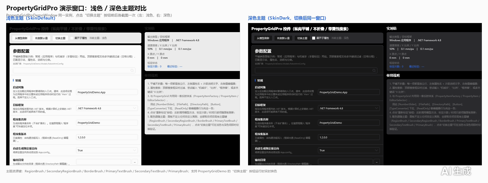

---
AIGC:
    Label: "1"
    ContentProducer: 001191440300708461136T1XGW3
    ProduceID: 09749610af649f3b41be24ad18fd73a1_03c38802b0e211f18f50525400aeaaa3
    ReservedCode1: ct3ZFPPZ5AqY1ezUKJJeoUk+k9YHHIX/spkHeuLzsntpbF/WNPWRj41bZJ6QrfqieV8HiSt/ZvXUMpSdCgXE4VJ5hQjA8iZY7pHkRPhtXjiqbsHkqoEe+MwrUEMs/cuq1sxO9aHXOgrQBsd1Fb+JZoAJj6Z3aOrAemj8V6ZYyvAkpeDT9SYGrYc/1KQ=
    ContentPropagator: 001191440300708461136T1XGW3
    PropagateID: 09749610af649f3b41be24ad18fd73a1_03c38802b0e211f18f50525400aeaaa3
    ReservedCode2: ct3ZFPPZ5AqY1ezUKJJeoUk+k9YHHIX/spkHeuLzsntpbF/WNPWRj41bZJ6QrfqieV8HiSt/ZvXUMpSdCgXE4VJ5hQjA8iZY7pHkRPhtXjiqbsHkqoEe+MwrUEMs/cuq1sxO9aHXOgrQBsd1Fb+JZoAJj6Z3aOrAemj8V6ZYyvAkpeDT9SYGrYc/1KQ=
---

# 08 常见问题 FAQ

> 目标：覆盖接入与使用中最常遇到的「不显示 / 不生效 / 不跟随 / 不刷新」类问题。

---

## 一、属性与列表

**Q1：属性没有出现在列表里？**

按顺序检查：

1. 是否为 `public` 且**有 getter 和 setter**（只写属性不显示）；
2. 是否被 `[Browsable(false)]` 隐藏；
3. 是否为静态属性、索引器或字段（**不支持**，仅支持实例属性）；
4. 是否为 `SelectedObject` 所在的真实类型（基类属性会显示，接口属性不会）；
5. 搜索框是否残留了过滤关键字（清空 `SearchText` 后再看）。

**Q2：列表顺序和我想的不一样？**

先按 `[Category]` 分组，组内按特性 `Order`（如 `PropertyOrderAttribute`）排序，未指定时按类型定义顺序排列。需要严格控制顺序时请显式加 `Order`。


**Q3：属性太多找不到？**

打开 `ShowSearchBar="True"`（默认开启）并输入关键字实时过滤；`PropertyGridPro` 还会显示匹配数量与空结果提示。

---

## 二、编辑与回写

**Q4：界面上改了值，模型里没变？**

- 检查属性的 `setter` 是否为空实现；
- 编辑器值通过双向绑定写回，若在编辑过程中抛异常（如 `setter` 内校验失败），值会回退；
- 对象外部被程序修改后界面不会自动感知，请调用 `RefreshProperties()`。

**Q5：复位按钮（R）为什么不出现？**

出现条件是属性**标注了 `[DefaultValue(...)]`** 且当前值不等于默认值。仅标注 `[ReadOnly]` 或没有默认值的属性不会有复位按钮。另注意：未悬停时按钮是「隐藏但保留占位」状态，属正常表现，不是为了不显示。

**Q6：鼠标移入移出时，同一行的编辑器会左右跳动？**

这是 1.3.0 已修复的问题（此前隐藏按钮用 `Collapsed` 会挤动布局）。升级到 1.3.0 后，复位按钮改用 `Hidden` 占位，实测编辑器位移 **0px**。若仍出现跳动，请确认未自行覆写 `RowTemplate` 中的按钮可见性转换器。


**Q7：改了一批属性，想一键恢复？**

```csharp
propertyGrid.ResetSelectedToDefault();   // 当前选中属性
propertyGrid.ResetAllToDefault();        // 全部属性
```

---

## 三、编辑器与特性

**Q8：自定义编辑器不生效？**

1. 确认注册使用的**特性类型**与属性上标注的一致（`RegisterEditor<TAttribute>` 按特性类型匹配）；
2. 确认 `DataTemplate` 已加载（在同一 `ResourceDictionary` 作用域内）；
3. 若模板缺失，控件会**回退**到内置编辑器，因此表现为「没变化」而不是报错；
4. 同一属性既有自定义特性又有内置编辑器特性时，宿主注册的模板优先。

**Q9：`[ToggleSwitch]` 标注了但外观没变？**

该特性**仅对 `bool`（含 `bool?`）属性生效**。若属性是 `string` / `int` 等类型，特性会被忽略并保持原有编辑器。另外：

- 未标注的 `bool` 属性也会显示滑块开关（不带状态文字），这是默认外观，属正常；
- 想完全不显示状态文字，使用 `[ToggleSwitch(OnText = null, OffText = null)]`。

| 默认 bool | `[ToggleSwitch]` | 自定义文字 |
|---|---|---|
|  |  |  |

**Q10：公式绑定区不显示？**

需要同时满足两点：属性类型为 `FormulaBound<T>`，且标注了 `[FormulaEditor(typeof(Provider))]` 或在控件上设置了 `FormulaTreeProvider`。详见 [05 公式绑定](05-公式绑定.md)。

**Q11：集合/字典点「编辑」没反应或改完不同步？**

- 集合属性建议声明为 `List<T>` 且**有 setter**；
- 若使用自定义集合类型，请实现 `IList`（字典实现 `IDictionary`）；
- 对话框确认后会把结果写回属性，若属性 setter 中做了深拷贝且未刷新，请调用 `RefreshProperties()`。

---

## 四、主题、语言与字体

**Q12：深色主题下控件部分区域仍是浅色？**

1. 确认宿主合并了 HandyControl 的主题资源字典（库内不重复合并，弹窗继承应用级资源）；
2. 若使用了自定义主题字典，请确保提供 `SkinDark` 等资源键，否则控件会回退到 HandyControl 默认画刷；
3. 主题切换需作用于**应用级**资源，而不是仅某个窗口。

**Q13：切换语言后部分文本没变？**

未在 `IPropertyLocalization` 实现中提供该属性/分类/枚举项的翻译时，会回退到 `[DisplayName]` 或属性名（属预期行为）。

**Q14：`LocalizationManager.CurrentLanguage` 提示已过时？**

1.3.0 起改用 `LocalizationManager.CurrentCulture`（`culture` 字符串开集，如 `"zh-CN"`、`"en-US"`），旧成员仅为兼容保留。

**Q15：全局字体设置了但弹窗没跟随？**

请使用静态成员 `PropertyGrid.GlobalFontFamily` / `PropertyGrid.GlobalFontSize`（会同步到所有弹窗编辑器），而不是只设置某个实例的属性。



---

## 五、工程与升级

**Q16：需要单独引用 HandyControl 吗？**

不需要。依赖已内嵌（Costura.Fody），引用 `PropertyGridLib` 即可；但**不要**在工程中再引用一个版本不同的 HandyControl，否则可能出现资源键冲突。

**Q17：从 1.2.0 升级到 1.3.0 需要注意什么？**

| 变更 | 影响 |
|------|------|
| 新增 `PropertyGridPro`、`[ToggleSwitch]` 等 | 纯新增，不影响既有代码 |
| 演示程序删除旧示例模型 `RobotArmConfig` | 仅影响直接引用该演示类型（如拷贝 Demo 代码）的工程，改用 `SampleObject` |
| 复位按钮占位方式由 `Collapsed` 改为 `Hidden` | 视觉更稳定；若自行覆写了可见性转换器需同步调整 |
| 主题硬编码改为主题资源键 | 使用自定义主题的宿主需保证资源键存在（缺失会自动回退） |

**Q18：`PropertyGrid` 和 `PropertyGridPro` 能共存于同一个窗口吗？**

可以。两者相互独立，可同时绑定同一个对象实例（各自维护自己的展开/选中状态）。

---

## 六、快速排查清单

| 现象 | 首查项 |
|------|--------|
| 行不显示 | 属性是否 public 且可读写、是否被 `[Browsable(false)]` |
| 值不改 | setter 是否有效、是否抛异常导致回退 |
| 复位按钮不见 | 是否标注 `[DefaultValue]` 且值已修改 |
| 编辑器不对 | 特性是否适用于该类型、是否有宿主模板覆盖 |
| 主题不对 | 宿主是否合并主题资源、资源键是否齐全 |
| 语言不刷新 | 本地化实现是否覆盖该文本 |
| 嵌套错位 | 是否覆写了 `RowTemplate` 或模板选择器 |

---

## 七、其它文档

- [01 快速开始与基础用法](01-快速开始与基础用法.md)
- [02 特性清单](02-特性清单.md)
- [03 编辑器类型总览](03-编辑器类型总览.md)
- [04 主题与多语言](04-主题与多语言.md)
- [05 公式绑定](05-公式绑定.md)
- [06 PropertyGridPro 平铺参数面板](06-PropertyGridPro-平铺参数面板.md)
- [07 示例模型与演示场景](07-示例模型与演示场景.md)
*（内容由AI生成，仅供参考）*
